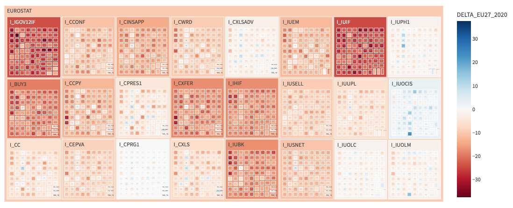
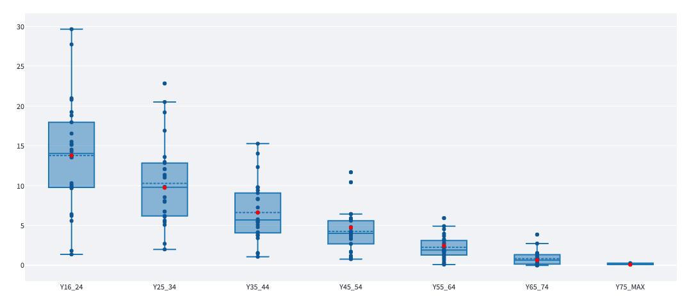

# Eurostat Digital economy and society Dashboard

Prototipo di cruscotto di analytics per la visualizzazione di una selezione di informazioni presenti nei dataset Eurostat scaricabili a [questo link](https://ec.europa.eu/eurostat/web/digital-economy-and-society/data/comprehensive-database).

Pagine presenti nella web app:

- **bde15cua treemaps:** Confronto nell'uso di internet da parte dei cittadini e delle famiglie in Italia e nei Paesi UE.

- **digital skills boxplots:** Confronto delle competenze digitali tra l'Italia e gli altri Paesi UE, con l'uso di grafici boxplot.

- **digital skills treemaps:** Confronto delle competenze digitali tra l'Italia e gli altri Paesi UE, con l'uso di grafici treemap.

- **ict in enterprises:** Confronto nell'uso dell'ICT nelle imprese tra l'Italia e gli altri Paesi UE.

- **nuts2 bars:** Confronto tra regioni italiane per tutti i dati presenti all'interno del database Eurostat dedicato alle famiglie e agli individui che abbiano granularità regionale (NUTS2)

Tutte le web app, per ragioni di performance, fanno uso di varie pre-elaborazioni del suddetto database all'interno della cartella **data/**.

Lo script di preprocessing non è al momento incluso nel repository.

## Immagini di esempio
Differenza dell'Italia rispetto alla media EU in tutte le 24 competenze considerate nel calcolo ufficiale Eurostat delle competenze digitali (dati 2019):

Distribuzione della percentuale di popolazione che ha usato un linguaggio di programmazione negli ultimi 12 mesi nei Paesi EU divisi per fascia d'età, con valore dell'Italia evidenziato in rosso (dati 2019):

## Sorgenti dato
- [Structural Business Statistics](https://ec.europa.eu/eurostat/web/structural-business-statistics/data/database)
- [Digital Economic and Society - Comprehensive database](https://ec.europa.eu/eurostat/web/digital-economy-and-society/data/comprehensive-database)

## Licenza:

    Copyright (c) the respective contributors, as shown by the AUTHORS file.

    This program is free software: you can redistribute it and/or modify
    it under the terms of the GNU Affero General Public License as published
    by the Free Software Foundation, either version 3 of the License, or
    (at your option) any later version.

    This program is distributed in the hope that it will be useful,
    but WITHOUT ANY WARRANTY; without even the implied warranty of
    MERCHANTABILITY or FITNESS FOR A PARTICULAR PURPOSE.  See the
    GNU Affero General Public License for more details.

    You should have received a copy of the GNU Affero General Public License
    along with this program.  If not, see <http://www.gnu.org/licenses/>.